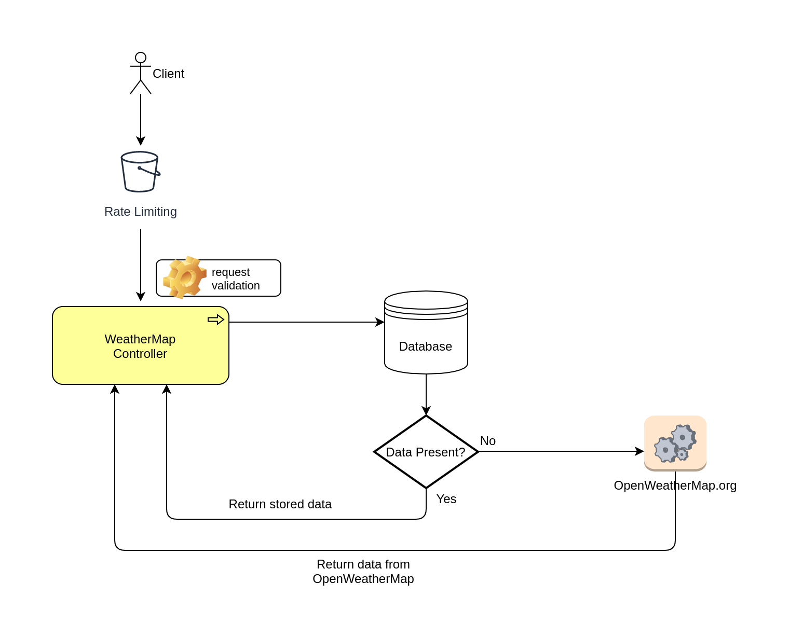

# WeatherMap

Do you think it's better to call an API to check the weather rather than looking out your window?
Or you might be curious about the weather conditions in a land far-far-away?
Say no more!

This app provides a REST API to get the current weather of any location, sourced from OpenWeatherMap.org.

Beware though - there is rate limiting built-in, so you can not just abuse it. 

## API Contract
Refer to the swagger document below.
[WeatherMap Swagger](src/main/java/api/weather.v1.swagger.yml)

### Endpoint
```
/weather-app/weather/{city}/{countryCode}
```

## Design


## Run it locally
It's a Gradle Spring-Boot application. To run it locally:
* Clone this repo.
* Run `./gradlew bootRun` inside the project
* Import Postman collection for Testing [WeatherMap Postman Collection](WeatherMap.postman_collection.json)
* Try getWeather API request from postman
* Alternatively, can try below curl to make api call
  ```
  curl --location 
  --request GET 'http://localhost:8080/weather-app/weather/london/uk' \
  --header 'x-api-key: WM-112'
  ```


